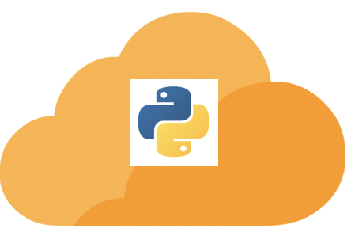
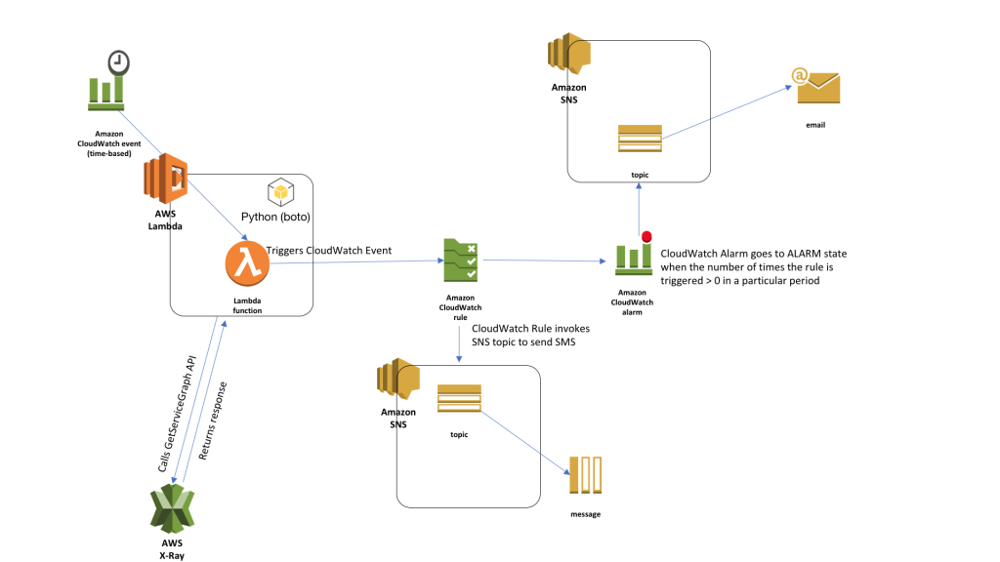
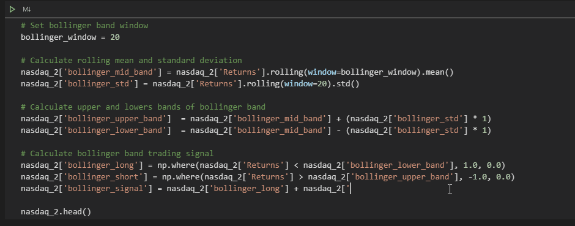
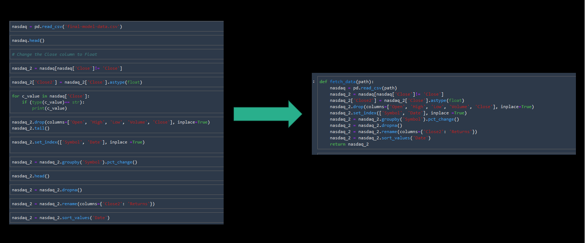
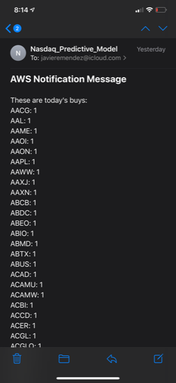

# Nasdaq Predictive Model

### Random Forest

## Purpose and Goal of this Project/Repository

Have you ever sat down at 5 o'clock to watch Mad Money or any after market show? And you listen to Jim Cramer talk and within about two minutes he lists off 8-10 companies that have been up "blank_%" and you're thinking why haven't I heard of these guys?... Well if you're anything like us, sometimes you miss one or two, so our goal for this project was to build something that would analyze live data and send us a daily list of *tickers* predicted to go up the following day. The idea is to help the average trader/investor who likes researching capital markets and active investing. But ultimately we attempted to make something we thought we would use ourselves. 
 

The predictive random forest model was trainied on all companies listed on the NASDAQ in the past year, and the data begins in April 2019 and ends July 2020. For a small fee we were able to test over 900,000 data points specifically looking at closing prices with regards to returns. Our primary goal is to identify stocks that can be expected to outperform the NASDAQ, then create a way to send us daily alert with the ticker symbols due to spike the next day. We had a 2 week deadline to complete and plan to continue to make improvements! 

### Team 

- Javier Mendez
- Reuben Lopez
- Scott Andersen 
- Sara Jankovic

### Contents of Repository

1. handler — Contains the necessary libraries that are required for the model to operate in AWS infrastructure, as well as an older version of the model (handler.py) which runs on a local machine but not AWS.
2. docker_deploy — Contains the most up-to-date model and necessary libraries that was executed on AWS Lambda (handler.zip), as well as the file necessary for deployment on AWS (Makefile).
3. nasdaq-historical-data — Contains historical data for the NASDAQ that the model is training and testing on, both as individual days and aggregated + cleaned. 
4. Images — Images used in the repository.

### Tools Used

- Excel
- Python
- Pandas (Python Library)
- Sklearn
- VS Code
- AWS Sagemaker
- AWS Lambda
- AWS S3
- AWS CloudWatch

## Process of Creating the Model 

As with all models, the quality of your model relies on the data you have. We were able to find historical data for all NASDAQ tickers as of July 2020 with the ability to backtest 10 years. We focused on YTD information so that we were able to factor in the volatility during the pandemic.  

It took us sometime to work with the dataset, but after we got a clean DataFrame we were able to view the 'Close' prices of each ticker and calculate daily returns with a shift to account for bias. 

We chose the Random Forest Classifier for two reasons: 
  
  1. Plenty of datapoints for the model to learn. 
  2. The data contained a couple significant events such as:

    A) Pre COVID
    B) COVID Crash
    C) COVID Recovery

After testing the model, we were able to predict returns with 100% accuracy...so naturally something had to be wrong. We spent all of our time on AWS Sagemaker, a service provided by Amazon that allows you to work on Jupyter Notebooks and collaborate on the same notebook without using Git - highly reccommend! AWS also offers access to their computing power so as long as your WiFi isn't terrible this is super helpful. Here is an example of what some of the code looks like: 

Once we had the model trained and running without error, the Team got together and uploaded the files through S3 and passed our data into a Lambda function. To finish, the 'makefile' had to run through CloudWatch / SNS in order to make the daily or weekly email alert possible. This step provided us with the opportunity to recieve feedback and connect with subscribers. To get an idea of what this looks like, here is a chunk of the code in cells compared to what it looks like in a function:

## Deploying the Model 

For the model to be useful, it needs to be deployable. Again, we opted to use AWS to execute the model once a day. We ran into a potential issue with our file sizes, in particular the data and imported libraries. To solve this we uploaded the data separately on S3, and then we used CloudWatch to configure the daily emails. After debugging, we were able to get it deployed and the email could be requested.

## Future Improvements

1. Incorporate a Regressor and train the data using different models (ARIMA).
2. Improve message to include: Distance to Earnings
3. Limit the number of Tickers that our function returns to top 15 companies. 

## Results
The results of the accuracy of the model are below:

Additionally, here is an example of what the email subscribers receive:

## How this is useful for you

There are a variety of ways you can trade with this knowledge, the two most common being:
 1. Active Investing: attempting to make you aware of high performing companies ahead of the news and identify trends quickly. 

 2. Seen as a template for creating your own framework using AWS and Machine Learning algorithms. 

## Resources

[Useful Article on Random Forest's and how they work.](https://en.wikipedia.org/wiki/Random_forest)

[Data Cleaning Tips and Tricks in Python](https://towardsdatascience.com/data-cleaning-in-python-the-ultimate-guide-2020-c63b88bf0a0d?gi=dd7bd10c80c6)

[AWS Sagemaker Tutorial](https://www.youtube.com/watch?v=8Vj7OaR4DcA)

[Random Forest Regression Article](https://towardsdatascience.com/random-forest-and-its-implementation-71824ced454)

[AWS Lambda Best Practices](https://docs.aws.amazon.com/lambda/latest/dg/best-practices.html)

[Know Ryan](https://www.linkedin.com/in/ryan-bacastow/)
